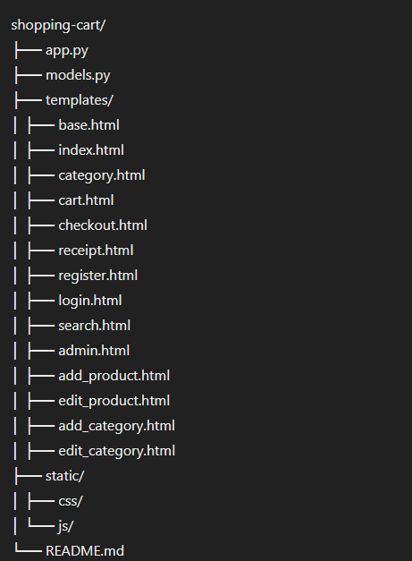

# Technical Documentation for Shopping Cart Application

## Overview

This document provides technical details about the Flask-based Shopping Cart application. The application features user registration, login, product search, shopping cart management, and admin functionalities for managing products and categories. It uses the Flask framework and Bootstrap for the frontend.

## Table of Contents

1. [Project Structure](#project-structure)
2. [Installation](#installation)
3. [Configuration](#configuration)
4. [Models](#models)
5. [Routes](#routes)
6. [Templates](#templates)
7. [Admin Features](#admin-features)
8. [Session Management](#session-management)
9. [Running the Application](#running-the-application)

## Project Structure



## Installation

1. **Clone the Repository**:
   ```bash
   git clone <repository-url>
   cd shopping-cart

2. Set Up a Virtual Environment:
   ```bash
   python3 -m venv venv
   source venv/bin/activate
3. Install Dependencies:
    ```bash
    pip install Flask

4. Run the Application:
    ```bash
    python app.py

### Configuration
Ensure the Flask secret key is set for session management:
```python
    app.secret_key = 'supersecretkey'
```

This key should be unique and kept secure.

### Models
### Product
The Product class represents a product in the store.

``` python
class Product:
    def __init__(self, product_id, name, price, category):
        self.id = product_id
        self.name = name
        self.price = price
        self.category = category

    @classmethod
    def from_dict(cls, data):
        return cls(
            product_id=data['id'],
            name=data['name'],
            price=data['price'],
            category=data['category']
        )
```
### Category
The Category class represents a product category.
``` python
class Category:
    def __init__(self, name):
        self.name = name
```
### User
The User class represents a user of the application.
``` python
class User:
    def __init__(self, username, password):
        self.username = username
        self.password = password  # In a real app, use hashed passwords

    def check_password(self, password):
        return self.password == password
```
### ShoppingCart
The ShoppingCart class manages the products in the cart.

``` python
class ShoppingCart:
    def __init__(self):
        self.items = []

    def add_product(self, product):
        self.items.append(product)

    def remove_product(self, product_id):
        self.items = [item for item in self.items if item.id != product_id]

    def get_total(self):
        return sum(item.price for item in self.items)

    def clear_cart(self):
        self.items = []
```
### Routes
#### User Authentication
#### Register: /register
#### Login: /login
#### Logout: /logout
#### Shopping Cart
#### iew Cart: /cart
#### Add to Cart: /add_to_cart/<int:product_id>
#### Remove from Cart: /remove_from_cart/<int:product_id>
#### Checkout: /checkout
#### Receipt: /receipt

#### Products and Categories
#### View Categories: /category/<category_name>
#### Search Products: /search
#### Admin
#### Admin Dashboard: /admin
#### Add Product: /admin/add_product
#### Edit Product: /admin/edit_product/<int:product_id>
#### Delete Product: /admin/delete_product/<int:product_id>
#### Add Category: /admin/add_category
#### Edit Category: /admin/edit_category/<string:category_name>
#### Delete Category: /admin/delete_category/<string:category_name>

### Templates
#### The application uses Jinja2 templates to render HTML pages.

#### base.html: The base template extended by other templates.
#### index.html: The homepage displaying products.
#### category.html: Displays products in a specific category.
#### cart.html: Displays the shopping cart contents.
#### checkout.html: Checkout form.
#### receipt.html: Displays the receipt after checkout.
#### register.html: User registration form.
#### login.html: User login form.
#### search.html: Search results page.
#### admin.html: Admin dashboard.
#### add_product.html: Form to add a product.
#### edit_product.html: Form to edit a product.
#### add_category.html: Form to add a category.
#### edit_category.html: Form to edit a category

### Admin Features
The admin interface allows managing products and categories. Only users with the username admin can access these routes.

#### Admin Routes
#### Admin Dashboard: Displays products and categories with options to add, edit, or delete.
#### Add Product: Form to add a new product.
#### Edit Product: Form to edit an existing product.
#### Delete Product: Action to delete a product.
#### Add Category: Form to add a new category.
#### Edit Category: Form to edit an existing category.
#### Delete Category: Action to delete a category.

### Session Management
The application uses Flask sessions to manage user authentication and shopping cart state.

#### Login: Stores the username in the session.
#### Logout: Clears the username from the session.
#### Shopping Cart: Stores the cart items in the session during checkout to generate the receipt.
#### Running the Application
1. Activate the Virtual Environment:
``` bash
source venv/bin/activate
```
2. Run the Flask Application:
``` python
python app.py

```
3. Access the Application:
Open a web browser and navigate to http://127.0.0.1:5000/.

With this documentation, you should have a comprehensive understanding of the Flask Shopping Cart application, including its structure, functionality, and usage.